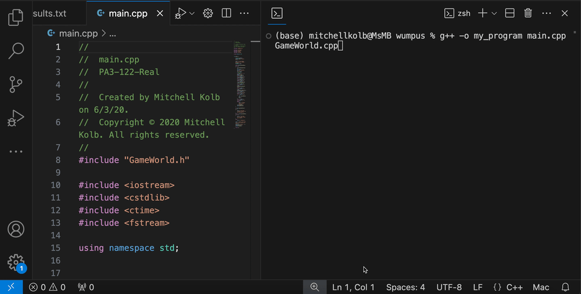

<h1 align="center">Hunt the Wumpus Game</h1>

<p align="center">
  

  

  

  
</p>

<p align="center">


</p>

This is a C++ implementation of 'Hunt the Wumpus,' a text-based adventure game where players navigate a 5x5 grid, seeking hidden gold while avoiding pits and the dangerous Wumpus. The game highlights object-oriented programming concepts like class design and file operations.



<details>
<summary style="color:#5087dd">Watch the Full Video Demo Here</summary>

[](https://www.youtube.com/watch?v=kajZ7d_00y0)

</details>

---


# Table of Contents
- [What I Learned](#what-i-learned-in-this-project)
- [Tools Used / Development Environment](#tools-used--development-environment)
- [Team / Contributors / Teachers](#team--contributors--teachers)
- [How to Set Up](#how-to-set-up)
- [Project Overview](#project-overview)
  - [Project Details](#project-details)
  - [Gameplay](#gameplay)
  - [Files and Structure](#files-and-structure)
  - [Results and Lessons Learned](#results-and-lessons-learned)
  - [Future Work](#future-work)
- [Acknowledgments](#acknowledgments)

---

# What I Learned in this Project
- Implementing and testing classes in C++ 
- Declaring and defining constructors / destructors 
- Understanding the use cases for public and private access specifiers in C++ 
- Apply and implement overloaded functions 
- Apply and implement overloaded operators (stream insertion and stream extraction) 


# Tools Used / Development Environment
- C++
- Xcode
- Terminal
- MacOS


# Team / Contributors / Teachers
- [Mitchell Kolb](https://github.com/mitchellkolb)
- Professor. Nadra Guizani


# How to Set Up
This project was implemented on my macbook using:
- Xcode at the time. Any terminal with gcc installed will work
- Clone this repository 
- Open terminal at the codebase `~.../wumpus/wumpus-codebase/`
- Run the `a.out` that is included or compile your own executable with
```zsh
g++ -o my_program main.cpp GameWorld.cpp
```
- Then use `./a.out` or `./my_program` depending on whatever you named your executable.


# Project Overview
I used C++ to create a text-based adventure game called "Hunt the Wumpus." This project is a part of a programming assignment for a Data Structures course. The game challenges players to navigate a maze, find hidden gold, and avoid deadly hazards like pits and the dreaded Wumpus that moves around the map as well.

## Project Details
In "Hunt the Wumpus," you play on a 5x5 grid that contains a variety of elements: the player (you), a Wumpus (the enemy), a pot of gold (your reward), and several pits (ranging from 5 to 10). The player starts at a random location and must explore the game world by making strategic moves, all while trying to avoid the Wumpus and pits. The objective is to find the gold without running into any hazards. I implemented features like displaying the entire game world, revealing only adjacent areas which creates a "fog of war", and allowing player movement in four directions.

## Gameplay
In my "Hunt the Wumpus," you control your character using the keyboard. The game is played in turns, where you decide your next move based on the current state of the game. Here are the controls and map icons:


- **Player/User:** On the map the player character is shown with `U`. This is the unit that you intended to move every turn.
- **Wumpus:** On the map the wumpus character is shown with `W`. You want to stay away from this unit every turn you move.
- **Pitt:** On the map the pitt icon is shown with `P`. You don't want to fall down this hole in the map.
- **Gold:** On the map the Gold icon is shown with `G`. This is the icon you want reach to win the game.
- **Move Up:** Press `i` or `I` to move the player up one square.
- **Move Down:** Press `k` or `K` to move the player down one square.
- **Move Left:** Press `j` or `J` to move the player left one square.
- **Move Right:** Press `l` or `L` to move the player right one square.
- **View Adjacent Tiles:** Press `v` or `V` to display the visible world, showing the caves adjacent to your current position.
- **Cheat Mode:** Press `c` or `C` to display the entire game world, revealing all hazards and the location of the gold.
- **Restart with Same Board:** Press `r` or `R` to restart the game using the same board setup after winning or losing.
- **Restart with New Board:** Press `n` or `N` to restart the game with a completely new board.
- **Quit Game:** Press `q` or `Q` to end the game.

On your turn, you can choose to move in any direction, reveal the adjacent tiles, or view the entire game board. The game continues until you either find the gold, encounter a Wumpus or a pit (resulting in a loss), or decide to quit. Each move you make is tracked, and points are awarded for surviving, with penalties for revealing parts of the game world or cheating.

## Files and Structure
- `main.cpp`: This file contains the main game loop, which initializes the game world, handles user inputs, and manages the game state.
- `GameWorld.cpp`: Here, I implemented the `GameWorld` class, which is responsible for the game environment and core functionalities like displaying the world and handling player movements.
- `GameWorld.h`: This header file declares the `GameWorld` class and its functions.


## Results and Lessons Learned
While developing this project, I reinforced my understanding of object-oriented programming concepts such as class design, constructors, destructors, and operator overloading. Implementing a simple game loop gave me valuable experience in managing game state and handling user inputs. I also learned the importance of input validation and file operations while in game development.


## Future Work
In the future, I would like to expand the grid size this coulde make each game more intense, add more complex hazards or rewards, and introduce different difficulty levels. Additionally, I’m considering making a new user interface with graphical elements and developing a more sophisticated AI for the Wumpus to make the game even more engaging.


--- 
# Acknowledgments
This codebase and all supporting materials was made as apart of a course for my undergrad at WSU for CPTS 122 - Data Structures C/C++ in the Summer of 2020. 

